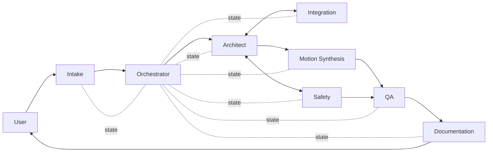

# Agent Roster — KUKA Agentic Workspace

Eight agents organized as a robot cell. Each has a single responsibility, a typed input and output, and an explicit list of peers it may confer with. The Orchestrator is the only agent that writes `task_state.json`; every other agent appends to its own key.

---

## Conferral Graph

---

## Roster

| Agent | File | Role | Robot-Cell Analog | Schema In | Schema Out |
|-------|------|------|-------------------|-----------|------------|
| Orchestrator | `orchestrator.md` | Cell PLC / supervisor | Cell PLC | any | `task_state` |
| Intake | `intake.md` | Parse user request into structured spec | Perception | free text | `program_intake` |
| Architect | `architect.md` | Program structure + variable allocation | Task planner | `program_intake` | `program_spec` |
| Integration | `integration.md` | I/O, fieldbus, handshake design | I/O layer | `program_intake` + draft `program_spec` | amended `program_spec` |
| Safety | `safety.md` | ISO 10218 / SafeOperation review | Safety PLC | `program_spec` (+ draft `.src` once available) | `safety_review` |
| Motion Synthesis | `motion-synthesis.md` | Generate `.src` / `.dat` files | Trajectory planner | `program_spec` | draft files + `handoff` |
| QA | `qa.md` | Lint + judgment review | Diagnostics | draft files + `program_spec` | `review` |
| Documentation | `documentation.md` | Handoff, operator docs, READMEs | HMI / logging | `review` + artifacts | `handoff` |

---

## Confers-With Matrix

|  | Orch | Intake | Arch | Integ | Safety | Motion | QA | Docs |
|--|------|--------|------|-------|--------|--------|----|------|
| **Orchestrator**  | —    |   R/W  | R/W  | R/W   | R/W    | R/W    | R/W| R/W  |
| **Intake**        | R/W  |   —    | —    | —     | —      | —      | —  | —    |
| **Architect**     | R/W  |   R    | —    | R/W   | R/W    | W      | —  | —    |
| **Integration**   | R/W  |   R    | R/W  | —     | R      | R      | —  | —    |
| **Safety**        | R/W  |   R    | R/W  | R     | —      | R      | R  | —    |
| **Motion**        | R/W  |   —    | R    | R     | R      | —      | W  | —    |
| **QA**            | R/W  |   —    | R    | R     | R      | R      | —  | W    |
| **Documentation** | R/W  |   —    | R    | R     | R      | R      | R  | —    |

Legend: R = reads peer output · W = writes into peer's input · R/W = bidirectional conferral.

---

## Usage (Cursor)

1. When acting as an agent, load its file as the system prompt:  
   `@.cursor/agents/<role>.md`
2. Spawn via the Task tool (`subagent_type` defaults to `generalPurpose`; the agent prompt does the specialization).
3. Validate output against `schema_out` before declaring done.

## Usage (Cowork)

Cowork is the Orchestrator by default. When Cowork needs to run another role:

1. Open the role file in context.
2. Act with that role's constraints (reads/writes, tools, schemas).
3. Return to Orchestrator mode after producing output.

## Adding a New Agent

1. Create `.cursor/agents/<name>.md` with the standard frontmatter.
2. Add a row to the Roster table above.
3. Update the Confers-With matrix.
4. Add its schema to `cowork/schemas/` if novel.
5. Reference it in any workflow under `cowork/workflows/` that involves it.
