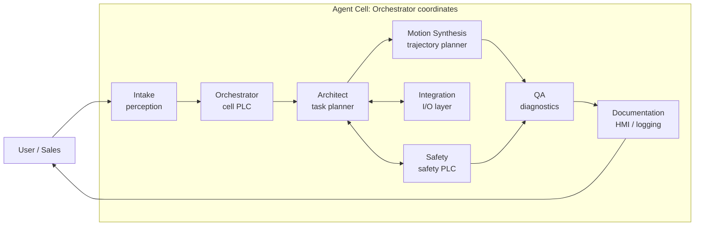

# KUKA Agentic Workspace — Master Instructions

This file is the single source of truth shared by Cursor IDE and Cowork (Claude Desktop). Both tools read it on session start. Anything specific to one tool lives in `CLAUDE.md` (Cowork) or `.cursor/` (Cursor).

---

## 1. Purpose

This workspace is an agentic environment for developing KUKA industrial robot programs (KR C4 / KR C5, KSS 8.x, KRL). Work is performed by a set of specialized agents that confer like a real robot cell.

---

## 2. Tool Roles

| Tool | Role | Owns |
|------|------|------|
| **Cursor IDE** | Hands — in-file editing, Cursor subagents, rule auto-application, skills | `.cursor/rules/*.mdc`, `.cursor/skills/*`, `.src`/`.dat`/`.sub`/`.py`/`.json`/`.md` file edits |
| **Cowork (Claude Desktop)** | Brain — orchestration, planning, multi-document review, report writing | `CLAUDE.md`, `AGENTS.md` (this file), `cowork/templates/`, `cowork/workflows/`, `cowork/schemas/` |

Neither tool duplicates the other's job. When Cowork plans work that needs code changes, it produces a schema-validated `HANDOFF_*.md` document Cursor consumes.

---

## 3. Agent Cell (the key idea)

The workspace is staffed by eight agents organized as a working robot cell. Each has one responsibility, a typed input, a typed output, and an explicit list of peers it may confer with.



Full roster with system-prompt definitions: `.cursor/agents/_ROSTER.md` and `.cursor/agents/<role>.md`.

| Agent | Robot-Cell Analog | Schema In | Schema Out |
|-------|-------------------|-----------|------------|
| Orchestrator | Cell PLC / Supervisor | any | `task_state.schema.json` |
| Intake | Perception | free text | `program_intake.schema.json` |
| Architect | Task planner | `program_intake` | `program_spec.schema.json` |
| Motion Synthesis | Trajectory planner | `program_spec` | `handoff.schema.json` (+ `.src`/`.dat` files) |
| Integration | I/O layer | `program_intake` + `program_spec` | merged into `program_spec` |
| Safety | Safety PLC | `program_spec` + `.src` draft | `safety_review.schema.json` |
| QA | Diagnostics | `.src` + `program_spec` | `review.schema.json` |
| Documentation | HMI / logging | `review` + artifacts | `handoff.schema.json` |

Every edge is schema-validated. If an agent emits a message that fails validation, the Orchestrator rejects the handoff and routes it back with the validation error — the agentic equivalent of a compile error.

---

## 4. Critical Rules

### 4.1 Knowledge Authority

1. **`kuka_dataset/normalized/` is the syntax authority.** Every claim about KRL syntax, KSS behavior, or KUKA best practice must cite a normalized dataset entry (or a fresh research finding with a T1/T2 source).
2. **`customer_programs/` is NOT authoritative.** Production backups contain errors and different programmer philosophies. Read them for application context; never copy their patterns without verification against the dataset.
3. **`kuka_dataset/raw_sources/` is ingested, not quoted.** Vendor PDFs are copyright-protected. Normalized entries summarize and cite; they do not extract verbatim.

### 4.2 KRL Conventions (TWA / industry-standard)

These are enforced by the QA agent, the `safety_lint` MCP server, and `.cursor/rules/kuka-krl-conventions.mdc`:

- `INI` block at the top of every main `DEF` program.
- `INTERRUPT DECL` for safety-relevant interrupts (E-stop, guard open) declared before first motion.
- Tool/base set explicitly via `$TOOL` and `$BASE` before motion; no implicit defaults.
- `$VEL.CP` / `$VEL_AXIS[]` / `$ACC.CP` set, not inherited.
- SPLINE blocks wrapped with `BAS(#INITMOV,0)` or equivalent initialization.
- No hard-coded numeric literals where a configuration variable belongs.
- Sub-programs (`GLOBAL DEF ... END`) live in their own `.src` files; shared data in `.dat` files.
- Error/recovery logic in dedicated sub-programs, not inline.
- Descriptive comments on every declaration: `DECL INT gripper_state ; 0=open 1=closed 2=fault`.
- Signal I/O accesses use named aliases from `$config.dat`, never raw `$IN[n]` / `$OUT[n]`.

### 4.3 Safety

- Every program that commands motion is reviewed by the Safety agent before it is declared "done."
- Any program touching safety-rated I/O, SafeOperation zones, or SafeRangeMonitoring requires a `SAFETY_REVIEW.md` artifact conforming to `safety_review.schema.json`.
- ISO 10218-1/-2 and (for collaborative applications) ISO/TS 15066 are the normative references. Deviations must be documented with rationale.

### 4.4 Fieldbus / Integration

- Profinet I/O mapping is authoritative in WorkVisual; `.cursor/rules/kuka-fieldbus.mdc` applies when editing fieldbus configuration or integration documents.
- For PLC-master-robot-slave architectures, prefer KUKA.PLC mxAutomation patterns (documented in `kuka_dataset/normalized/protocols/`).
- For sensor-guided motion and real-time external control, use RSI per vendor documentation.
- For loose-coupled external messaging, use EKI XML.

---

## 5. Workspace Map

| Domain | Index / Entry Point | What It Maps |
|--------|---------------------|--------------|
| KRL syntax & patterns | `kuka_dataset/DATASET_INDEX.md` | Normalized knowledge by topic |
| Dataset ingestion | `kuka_dataset/INGESTION_SCHEMA.md` | Frontmatter + chunking rules |
| Customer programs | `customer_programs/PROGRAM_REPOSITORY_INDEX.md` | Per-customer application context |
| Agent roster | `.cursor/agents/_ROSTER.md` | Agent definitions + confer-graph |
| Workflows | `cowork/workflows/` | End-to-end agent workflows |
| Schemas | `cowork/schemas/` | JSON Schemas for every handoff |
| Research | `research/RESEARCH_PROMPT_KUKA_KRL.md` | Deep-research prompt + tracking |
| MCP | `mcp_servers/README.md` | Tools exposed to agents |

---

## 6. MCP Tools Available to Agents

Three MCP servers ship with this template. See `mcp_servers/README.md` for setup.

| Server | Tools | Used by |
|--------|-------|---------|
| `kuka_knowledge` | `search`, `get`, `list_by_tag`, `related`, `reindex` | Architect, Motion, Integration, Safety, QA |
| `program_repository` | `list_customers`, `get_program`, `search`, `diff` | Intake, Architect, QA |
| `safety_lint` | `lint_src`, `list_rules`, `explain_rule` | QA, Safety |

Agents must prefer MCP tools over `Grep`/`Read` for knowledge retrieval — the servers are indexed, scoped, and citation-aware.

---

## 7. Handoff Protocol

When any agent completes work that another agent must consume:

1. Produce the output document at the expected path (see each agent's definition).
2. Validate output against its schema (`cowork/schemas/<name>.schema.json`).
3. Append a summary entry to `task_state.json` under the agent's key (Orchestrator-owned file).
4. If the handoff requires Cursor code edits (from Cowork) or a Cursor subagent, produce a `HANDOFF_<task>_<YYYY-MM-DD>.md` using `cowork/templates/HANDOFF_TEMPLATE.md`.

`HANDOFF_*.md` minimum contents:
- Target files (path + action)
- Applicable `.cursor/rules`
- Dataset references (from `kuka_dataset/normalized/`)
- Numbered edit instructions
- Acceptance criteria

---

## 8. Task State

Every in-progress piece of work has a `task_state.json` at its working directory (usually `customer_programs/<id>/<system>/task_state.json`). The Orchestrator owns writes; every other agent appends under its key. Schema: `cowork/schemas/task_state.schema.json`.

Example keys:
```json
{
  "task_id": "...",
  "status": "architect",
  "intake": { "...": "..." },
  "architect": { "...": "..." },
  "integration": { "...": "..." },
  "safety": { "...": "..." },
  "motion": { "...": "..." },
  "qa": { "...": "..." },
  "documentation": { "...": "..." }
}
```

---

## 9. When Something Is Missing

If an agent needs knowledge that is not yet in `kuka_dataset/normalized/`:

1. Check `research/RESEARCH_TRACKING.md` — maybe it's a known gap.
2. If yes, use `kuka_knowledge.search` with the nearest available topic and clearly flag the gap in output.
3. If no, add it to `RESEARCH_TRACKING.md` and proceed with the best available information, citing the gap.
4. Never invent KRL syntax. When uncertain, say so.

---

## 10. Copyright & Safety

- Raw KUKA manuals are in `kuka_dataset/raw_sources/` (LFS + `.cursorignored`). They stay local.
- Normalized entries summarize and cite (page numbers, section titles) — they never include verbatim extracts longer than a short quote needed for precision.
- Safety is never a speed bump. A program that does not pass the Safety agent does not ship.

---

## Revision

Update this file when the agent roster, schemas, or critical rules change. It is the contract; everything else is implementation.
