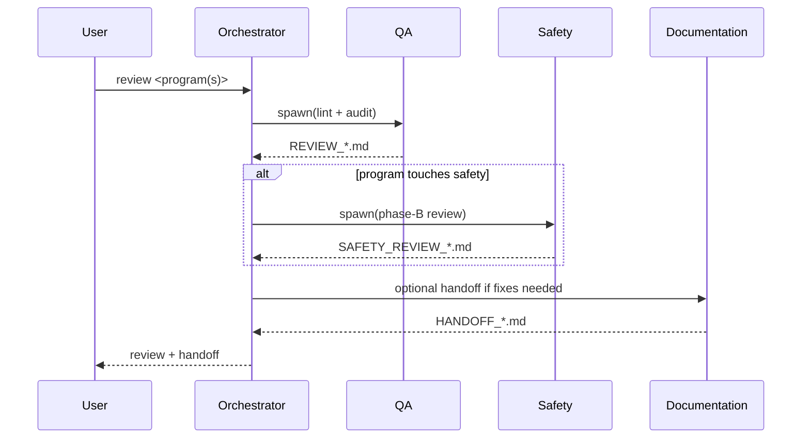

# Workflow: Code Review

Audit one or more existing KRL programs against TWA conventions, safety rules, and canonical dataset patterns. Output actionable findings.

**Who runs this:** Orchestrator.
**Duration:** minutes per program.
**Does NOT modify code.** Produces review + optional handoff for Cursor to fix.

## Overview

## Inputs

- Customer id + program name(s), or a directory of `.src` files.

## Outputs

- `REVIEW_<customer>_<system>_<YYYY-MM-DD>.md`
- `SAFETY_REVIEW_*.md` (if applicable)
- `HANDOFF_*.md` (if fixes recommended)

## Steps

### Step 1 — Scope

Orchestrator resolves the review scope:
- `program_repository.get_program(customer_id, name)` per program.
- Or `program_repository.search(".*\\.src", scope=<customer_id>)` for a full audit.

Create task directory; initialize `task_state.json`; status `qa`.

### Step 2 — QA Review

QA runs:

1. `safety_lint.lint_src(<path>)` per file.
2. Convention audit (10 checks).
3. Pattern comparison via `kuka_knowledge.search`.
4. Spec conformance (if a `PROGRAM_SPEC_*.md` exists for the customer system).

Produces `REVIEW_*.md` with verdict.

### Step 3 — Safety (if motion-bearing)

If any reviewed program commands motion, Orchestrator spawns Safety Phase B on the same files. Safety produces `SAFETY_REVIEW_*.md`.

### Step 4 — Fix Handoff (optional)

If QA found WARNING or CRITICAL:

Orchestrator spawns Documentation to author `HANDOFF_*.md` listing fixes in implementation order (Critical → Warning → Info). Cursor (or the user) applies fixes.

### Step 5 — Close

Set `task_state.status = "done"`. Update customer README with a change-log entry noting the audit was performed and findings count.

## Retry / Escalation

- Review is idempotent; re-run freely.
- If a program lacks a spec, QA still runs conventions + lint + pattern comparison; spec conformance is skipped with a note.

## Exit Criteria

- `REVIEW_*.md` written and schema-valid.
- `SAFETY_REVIEW_*.md` written if motion-bearing.
- `HANDOFF_*.md` written if fixes are recommended (optional).
