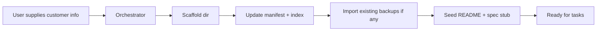

# Workflow: Customer Onboarding

Add a new customer (and their first system) to the workspace.

**Who runs this:** Orchestrator.
**Duration:** 15–30 minutes once information is in hand.

## Overview



## Inputs

- Customer identifier (prefix + short name, e.g. `042-XY`).
- Customer business name.
- Robot models & controllers per system.
- KSS versions.
- Known systems (cells) and application types.
- Optional: existing program backups to import.

## Outputs

- `customer_programs/<id>/` directory with:
  - `README.md` (customer overview)
  - `_manifest.json` (customer manifest)
  - One subdirectory per system (each with its own `README.md`)
- Updated `customer_programs/PROGRAM_REPOSITORY_INDEX.md`
- Updated `customer_programs/_manifest.json` (top-level)

## Steps

### Step 1 — Collect Information

If any field is missing, Orchestrator asks the user. Required:

- Customer id, business name, contact, industry.
- Systems (cells): name, application, robot model, controller, KSS version, fieldbus, collaborative?
- Existing program backups available? Location?

### Step 2 — Scaffold Directory

Create:

```
customer_programs/<id>/
  README.md
  _manifest.json
  <system_1>/
    README.md
  <system_2>/
    README.md
  ...
```

`README.md` (customer level): short description, systems table, contact, history.
`_manifest.json`: customer-level manifest (see schema below).
Per-system `README.md`: application, robot, controller, backups list, known programs, integration notes.

### Step 3 — Update Top-Level Indexes

- Append to `customer_programs/PROGRAM_REPOSITORY_INDEX.md` (the top table).
- Append to `customer_programs/_manifest.json` (machine manifest).

### Step 4 — Import Existing Backups (optional)

If backups are provided:

1. Copy into `customer_programs/<id>/<system>/YYYY-MM-DD_backup/` (timestamp the import).
2. Never rename files — preserve the customer's on-controller filenames.
3. For each `.src` / `.dat`, add a short summary line to the system `README.md`.
4. Do NOT ingest these into `kuka_dataset/` — customer programs are not dataset material.

### Step 5 — Seed Spec Stub (optional)

If a new task is imminent, create `tasks/<YYYY-MM-DD_slug>/` with an empty `task_state.json` and let the user proceed to `program_generation` workflow.

### Step 6 — Commit

Single commit "Onboard customer `<id>`: `<business name>`" with all scaffolding.

## Templates

- Customer `README.md` stub: see `customer_programs/_example_customer/README.md`.
- `_manifest.json` schema: `customer_programs/_manifest.schema.json`.

## Exit Criteria

- Customer directory exists and is populated.
- Top-level index and manifest updated.
- `program_repository.list_customers()` returns the new customer.
