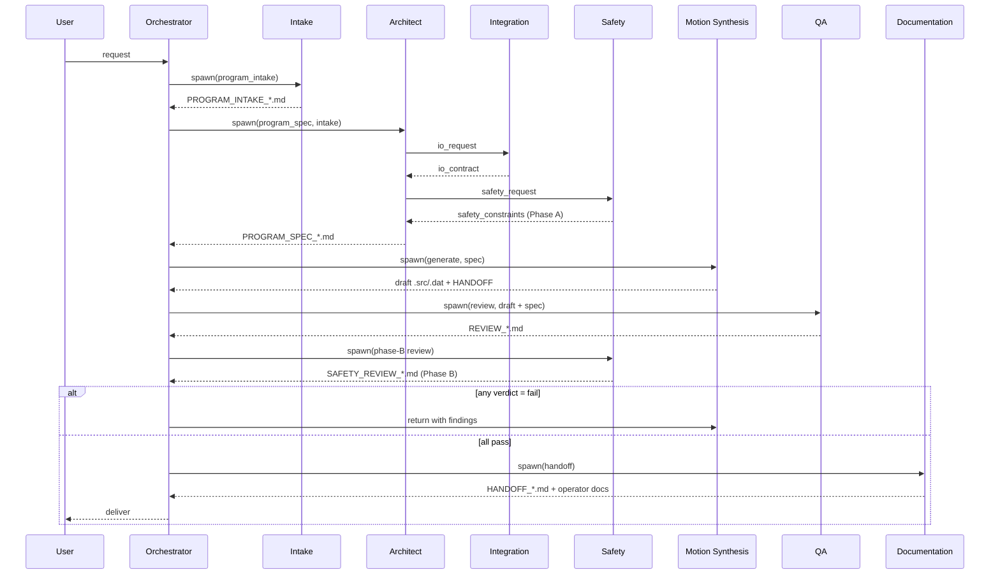

# Workflow: Program Generation

End-to-end generation of a new KRL program from a user request.

**Who runs this:** Orchestrator (Cowork).
**Duration:** hours to days depending on complexity.

## Overview

## Inputs

- User request (free text).

## Outputs

- `PROGRAM_INTAKE_*.md`
- `PROGRAM_SPEC_*.md`
- `INTEGRATION_SPEC_*.md` (merged into spec)
- `SAFETY_REVIEW_*.md` (Phase A and Phase B)
- Draft `.src` / `.dat` files
- `REVIEW_*.md`
- `HANDOFF_*.md` and operator docs

## Steps

### Step 1 — Initialize task_state

Orchestrator: create task directory and `task_state.json` from `cowork/templates/task_state.template.json`. Assign `task_id` (UUID). Status: `intake`.

### Step 2 — Intake

Orchestrator spawns Intake agent with the user request. Intake produces `PROGRAM_INTAKE_*.md`. Orchestrator validates against `program_intake.schema.json`, updates `task_state.intake`, sets status `architect`.

If open questions remain, Orchestrator surfaces to user before proceeding.

### Step 3 — Architecture

Orchestrator spawns Architect with `program_intake`. Architect confers with Integration and Safety in sequence:

1. Architect → Integration: `io_request`.
2. Integration produces `INTEGRATION_SPEC_*.md`, returns `io_contract` reference.
3. Architect → Safety: `safety_request`.
4. Safety produces `SAFETY_REVIEW_*.md` (Phase A) with constraints.
5. Architect composes full `PROGRAM_SPEC_*.md` merging both.

Orchestrator validates `program_spec.schema.json`, updates `task_state.architect`, sets status `motion`.

### Step 4 — Motion Synthesis

Orchestrator spawns Motion Synthesis with the program spec. Motion produces `.src` and `.dat` files plus a `HANDOFF_*.md`. Orchestrator validates file presence against `spec.modules`. Sets status `qa`.

### Step 5 — QA Review

Orchestrator spawns QA with drafts + spec. QA runs `safety_lint` + convention audit + pattern comparison. Produces `REVIEW_*.md`. Verdict:

- `fail` → Orchestrator returns to Motion with findings (retry; budget 2). Loop.
- `conditional` → continue but record for post-deploy fix.
- `pass` → continue.

Sets status `safety` for Phase-B review.

### Step 6 — Safety Phase B

Orchestrator spawns Safety with drafts. Safety re-runs lint, checks Phase-A constraints satisfied in code, verifies interrupts / tool / base / load. Produces `SAFETY_REVIEW_*.md` Phase B.

- `fail` → back to Motion.
- `conditional-pass` → continue; note required fixes before production.
- `pass` / `pass-with-notes` → continue.

Sets status `docs`.

### Step 7 — Documentation

Orchestrator spawns Documentation with review + artifacts. Documentation produces final `HANDOFF_*.md`, updates customer README, produces operator doc if required. Sets status `done`.

### Step 8 — Deliver

Orchestrator surfaces final handoff to user. Updates `task_state.handoffs[]`.

## Retry / Escalation

- Per step retry budget: 2 attempts.
- On exhaustion: surface to user with diagnostic (`task_state.retries[]`).
- Conflicts between agents: record in `conflicts[]`, ask user to adjudicate.

## Exit Criteria

- `task_state.status == "done"`.
- QA verdict in `{pass, conditional}`.
- Safety Phase B verdict in `{pass, pass-with-notes, conditional-pass}`.
- All artifacts listed in `task_state.artifacts[]`.
